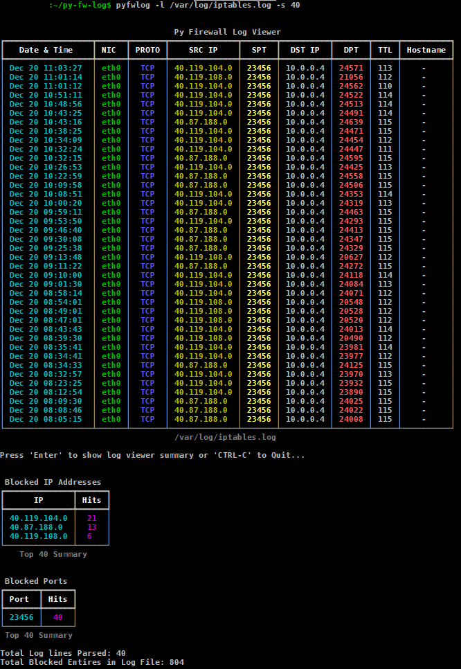

# Py Firewall Log View
- Python IPTables Log Viewer

## Tables of Conents

* [General Info](#general-information)
* [Usage](#usage)
* [Screenshots](#screenshots)
* [Setup](#setup)
* [Notes](#notes)

## General Information

- A Python program to parse iptables log files and present the information in a console table.
- The Program provides a summary of IP address total hits.
- The Program provides a summary of Ports total hits.
- The Program provides DNS resolution of IP Addresses (Optional).

## Usage

python py-fw-log.py -l "<logfile>" -s <LinesToShow> -d [DNS Lookup]

## Screenshots

## Setup

* Setup the project from source files;

    - Download and install Python >=3.10.5 from https://www.python.org/downloads/

    - Ensure Python is added to environment SYS Path.

    - Clone this repo to local file system.

    - Install deps from the provided requirements.txt file as per below;
 
        - pip3 install -r requirements.txt

## Notes

   - Only supports IPV4 IPTables log files.
   - Will look to add firewalld log files in the future.
   - Tested on ubuntu + iptables. 
