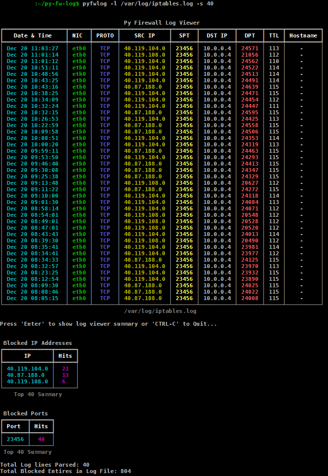

# Py Firewall Log View
- Python IPTables Log Viewer

## Tables of Conents

* [General Info](#general-information)
* [Usage](#usage)
* [Screenshots](#screenshots)
* [Setup](#setup)
* [Notes](#notes)

## General Information

- A Python program to parse iptables log files and present the information in a console table.
- The Program provides a summary of IP address total hits.
- The Program provides a summary of Ports total hits.
- The Program provides DNS resolution of IP Addresses (Optional).

## Usage

```
python3 py-fw-log.py -l <LogFile> -s <LinesToShow> -i <ignore_ipaddress> -d [DNS Lookup]
```

or

- Follow the Linux command Alias setup documented in the setup section to use the following command.

```
pyfwlog -l <LogFile> -s <LinesToShow> -i <ignore_ipaddress> -d [DNS Lookup]
```

## Screenshots



## Setup

* Setup the project from source files;

    - Download and install Python >=3.10.5 from https://www.python.org/downloads/

    - Ensure Python is added to environment SYS Path.

    - Clone this repo to local file system. (i.e home directory)
    
        ```
        git clone https://github.com/dunneja/py-fw-log
        ```
        
    - Install deps from the provided requirements.txt file as per below;
    
        ```
        pip3 install -r requirements.txt
        ```
        
    - Linux Command Alias
    
        - Add the following to ~/.bashrc
        
        ``` 
        if [ -f ~/.bash_aliases ]; then
            . ~/.bash_aliases
        fi
        ```
        
        - Add the following to ~/.bash_aliases
        
        ```
        alias pyfwlog='python3 /home/username/py-fw-log/py_fw_log.py'
        ```
        
        - run source update
        
        ```
        source ~/.bashrc'
        ```
        
        - run pyfwlog -h for usage / options.

## Notes

   - Only supports IPV4 IPTables log files.
   - Tested on ubuntu + iptables. 
